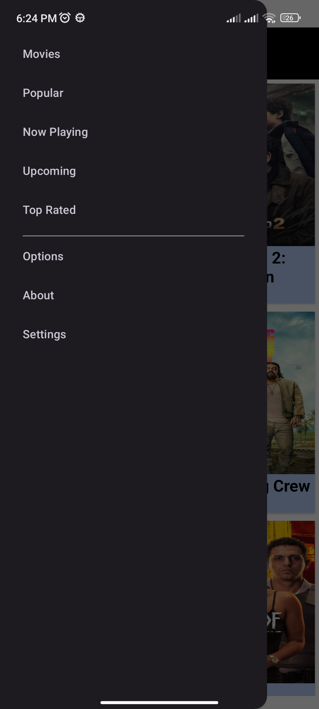

# Movie-App-V2

## 🎯 Objetivo del proyecto
- Refactorizacíon de codigo en Kotlin
- Mejorar la interfaz en base a la version anterior.
- Ve las reseñas de las peliculas y series del momento usando los servicios de TheMovieDatabase.
- Implementación de LiveData y DataBinding.
- Tenga arquitectura clara.
- Kotlin + MVVM.
- Sea fácil de mantener y extender.

## 🚀 Características
- Interfaz de usuario limpia e intuitiva.
- Desarrollada con Java.
- API´s Rest.
- Sigue las mejores prácticas de Android.

## 🛠️ Tecnología utilizada
- Android SDK
- Kotlin
- Gradle
- API´s Rests
- LiveData y DataBinding
- Arquitectura MVVM

## 📌 Mejoras futuras
- Agregar sección de series.
- Agregar menus de configuracion de la app (color de fondo, idioma, horario, region).

## 📱 Screenshots

  
  

## 🎥 Demo

  

## 👤 Autor
Adrián Hernández López / 
Desarrollador Android
